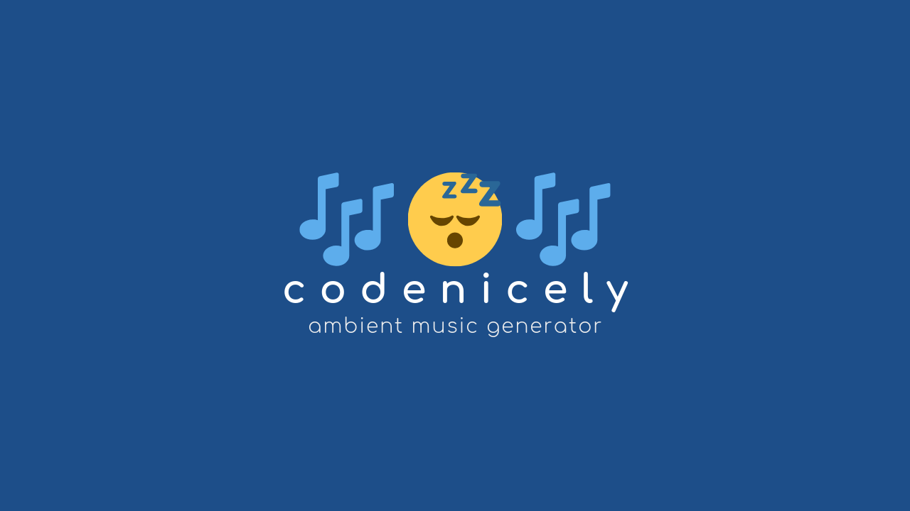

# CodeNicely

> CodeNicely is an online tool to play ambient music to help you code with ease.

## Preview
[Live Preview](https://mobihack.github.io/codenicely/) - Demo website 

## Built With

* [Bulma](https://bulma.io/) - The web framework used
* [FontAwesome 4.7](https://fontawesome.com/v4.7.0/) - Dependency Management

## Todo

* Music Visualizer lite 🙂
* amoled dark mode 😎
* easter egg of some kind 😉
* ~~Update to bulma framework~~ DONE
* ~~remove jquery and use vanila js as this project is simple~~ DONE
* ~~better logo~~ no need
* ~~ads~~ never
* ~~premium audio for registered or ad users~~ never

## Contributing

Please read [CONTRIBUTING.md](./CONTRIBUTING.md) for details on our code of conduct, and the process for submitting pull requests to us.

## License

This project is licensed under the MIT License - see the [LICENSE.md](LICENSE.md) file for details

## Donation
If this project help you reduce time to develop, you can give me a cup of coffee :) 

